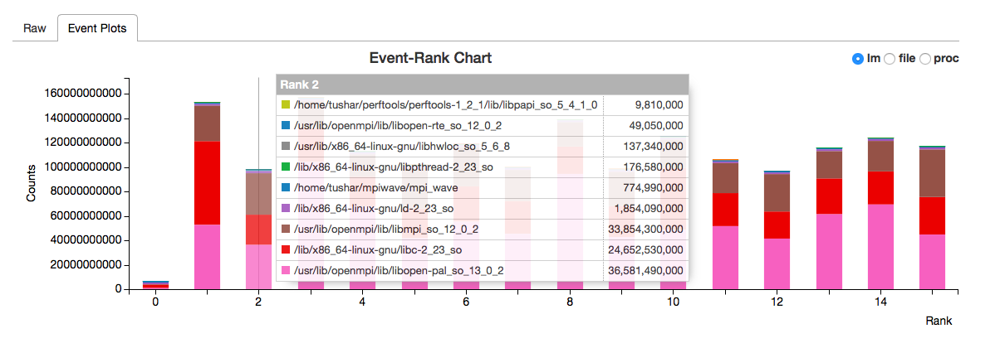

In this post we will look at how `hpcrun-flat` can be used to profile an MPI application. 
The [program we will look at](https://computing.llnl.gov/tutorials/mpi/samples/C/mpi_wave.c) 
solves a concurrent wave equation using point-to-point communications.

We will download and build `perftools`. We will then run the application 
under `hpcrun-flat`. `hpcrun-flat` statistically profiles application
functions, and figures out the approximate time spent in each function or module.

Finally, we will upload the data to [PerfBrowser Cloud](https://perfbrowser.perftools.org), 
and see some pretty plots in our browser!

* TOC
{:toc}


## Build perftools

Let's download and build `perftools`:
```
$ git clone https://github.com/tushar-mohan/perftools.git
$ cd perftools
```

Before we start the build, let's make sure we have the build dependencies:
```
$ ./build.sh --checkdeps
Checking dependencies.. 
gcc.. ok
g++.. ok
gfortran.. ok
mpicc.. ok
mpirun.. ok
patch.. ok
curl.. ok
python.. ok
cmake.. ok
autoconf.. ok
bunzip2.. ok

All build dependencies satisfied.
```

If you encounter problems with build dependencies, [check out the documentation](https://github.com/tushar-mohan/perftools/blob/master/README.md#build-dependencies) for your Linux distro.

Let's fire the build. We will add the `--all` flag to build the full
perftools' suite, including hpctoolkit. This takes approximately 30
minutes, so make sure you have coffee at hand!
```
$ ./build.sh --all
```

If all goes well, the output will contain something like:

```
=======================================================================
Tools are installed in:
/home/tushar/perftools/perftools-1.2.1

To use the tools
----------------
module load /home/tushar/perftools/perftools-1.2.1/perftools
	   - or -
source /home/tushar/perftools/perftools-1.2.1/perftools.sh
	   - or -
source /home/tushar/perftools/perftools-1.2.1/perftools.csh

To test install:
make test
make fulltest
=======================================================================
```

So perftools were built, and installed in the subdirectory `perftools-1.2.1`.

Running the full test suite:
```
$ make fulltest
...
10 of 10 PASSED
make[1]: Leaving directory '/home/tushar/perftools/papiex'
```

If the first test fails, you may need to [enable performance counter access for ordinary users](https://github.com/tushar-mohan/perftools/blob/master/README.md#enable-access-to-cpu-counters).

Let's add perftools to our shell environment:
```
$ module load /home/tushar/perftools/perftools-1.2.1/perftools
```

You may also want to add the above command to our `.login` or `.profile`.

At this point, we have `hpcrun-flat` in our `PATH`:
```
$ hpcrun-flat -V
hpcrun-flat: A member of HPCToolkit, version 5.4.0
```

You will also find `hpcrun2json` in your `PATH`. This script will
convert the binary `hpcrun-flat` output into json, suitable for
upload to PerfBrowser Cloud.

## Download and build mpiwave
```
$ mkdir mpiwave; cd mpiwave
$ curl https://computing.llnl.gov/tutorials/mpi/samples/C/mpi_wave.c | sed /draw_wave/d > mpi_wave.c
$ mpicc -g -O2 -o mpi_wave mpi_wave.c -lm
```
We use `sed` to remove references to a `draw_wave` function, which is not pertinent to this study.


## Run mpiwave under hpcrun-flat
Running the program under `hpcrun-flat` is simple. Note, at present
`hpcrun2json` can only handle single-event measurements with `hpcrun-flat`.
So, in the command-line below, we measure `PAPI_TOT_CYC`, with a sampling
period of 99999/second. You can increase the period for longer runs.
`-tall` combines all the thread profiles for a process into a single
shared profile. At present, we cannot handle individual thread profiles.

```
$ cd mpiwave
$ mpirun -np 16 hpcrun-flat -e PAPI_TOT_CYC:99999 -tall ./mpi_wave
Starting mpi_wave using 16 tasks.
Using 800 points on the vibrating string.
Enter number of time steps (1-10000): 
10000
...
```

Once the run finishes, `hpcrun-flat` will create one profile per process,
so a total of 16 profiles for this run.
```
$ ls *.hpcrun-flat*
mpi_wave.hpcrun-flat.gulftown.31791.0x0  mpi_wave.hpcrun-flat.gulftown.31807.0x0
mpi_wave.hpcrun-flat.gulftown.31793.0x0  mpi_wave.hpcrun-flat.gulftown.31809.0x0
mpi_wave.hpcrun-flat.gulftown.31795.0x0  mpi_wave.hpcrun-flat.gulftown.31811.0x0
mpi_wave.hpcrun-flat.gulftown.31797.0x0  mpi_wave.hpcrun-flat.gulftown.31813.0x0
mpi_wave.hpcrun-flat.gulftown.31799.0x0  mpi_wave.hpcrun-flat.gulftown.31815.0x0
mpi_wave.hpcrun-flat.gulftown.31801.0x0  mpi_wave.hpcrun-flat.gulftown.31817.0x0
mpi_wave.hpcrun-flat.gulftown.31803.0x0  mpi_wave.hpcrun-flat.gulftown.31819.0x0
mpi_wave.hpcrun-flat.gulftown.31805.0x0  mpi_wave.hpcrun-flat.gulftown.31820.0x0
```

You may also want to run `hpcstruct` to generate loop information from the binary,
although we won't be needing it for this experiment.
```
$ hpcstruct mpi_wave
$ ls *.hpcstruct
mpi_wave.hpcstruct
```

## Uploading hpcrun-flat data to PerfBrowser Cloud
To view the `hpcrun-flat` profiles in PerfBrowser Cloud, we need the output to be in
JSON format. `hpcrun2json` will accomplish that.

If you haven't done so, [sign up for a free-trial PerfBrowser Cloud account](https://perfbrowser.perftools.org/static/index.html#/signup). If you login using OAuth, make sure you set a new password. You will need it with `pbctl`.

Make sure your `pbctl` binary is setup. If not, it's easy:
```
$ curl -s https://raw.githubusercontent.com/tushar-mohan/pbctl/master/pbctl -o $HOME/bin/pbctl
$ chmod +x $HOME/bin/pbctl
$ pbctl version
1.1.4
```

The first time you use `pbctl`, you will need to authenticate using your
PerfBrowser Cloud login and password:
```
$ pbctl login
Username or email: test123@example.com
Password: 
Login successful (token saved)
```

Now let's upload:
```
$ hpcrun2json *.hpcrun-flat.*| pbctl import
Events (1): PAPI_TOT_CYC
Ranks: 16
Uploading 111658 bytes..
{
  "id": 8, 
  "info": {
    "nranks": 16
  }, 
  "name": "MKRZJNHQBG", 
  "userId": 1, 
  "webUrl": "https://perfbrowser.perftools.org/static/index.html#/jobs/8"
}
import of - successful
```

## Visualizing in PerfBrowser Cloud

Copy-paste the URL emitted by `pbctl import` in a browser


The view shows `PAPI_TOT_CYC` (a measure of user cycles) spent in different modules
by each task. It's interesting that `rank 0` has the least user cycles. Clearly, the
work is done by other ranks. Also, you will see more than 50% of the time is spent
in the calls within the `openmpi library`. 



If you select `file` option radio button, you will see a breakup by file as below.
The `proc` corresponds to profiling by functions.

